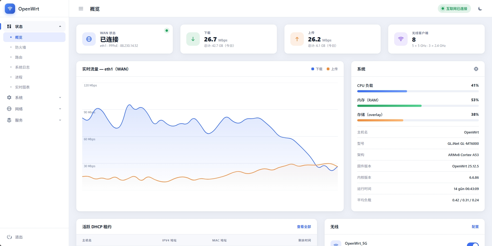
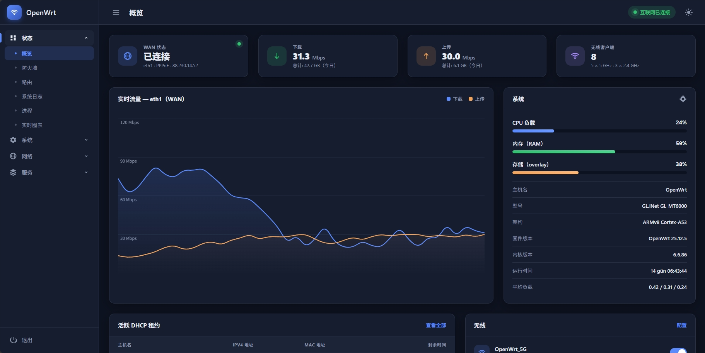
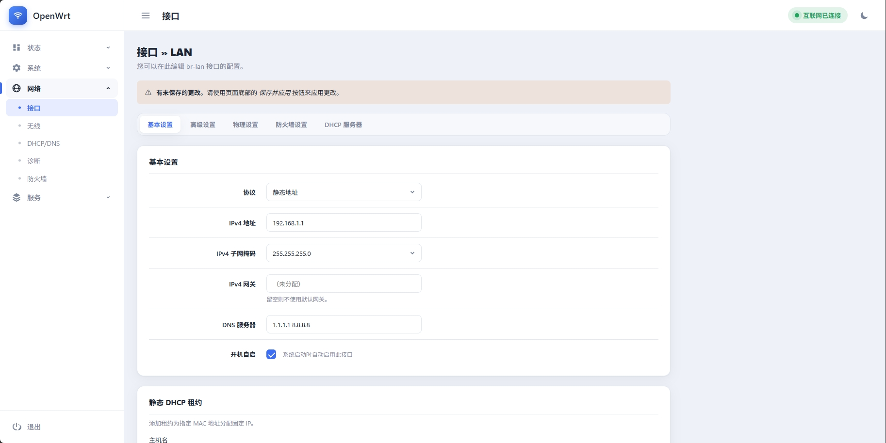
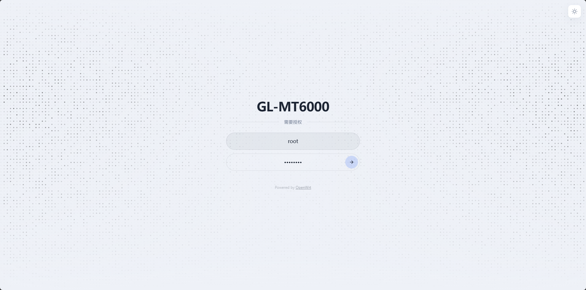

# luci-theme-goflow

OpenWrt 现代化的可折叠侧边栏 LuCI 主题，支持自动/暗色/亮色三种模式。

基于当前 ucode 版 LuCI 构建（无 `luasrc/` Lua 模板），目标平台为 **OpenWrt 25.12**。结构上基于官方 `luci-theme-bootstrap` 包（Apache-2.0），将顶部下拉导航替换为左侧边栏，并对 CBI 表单/表格/按钮样式进行了重新设计。

**仪表盘 — 亮色 / 暗色**

| 亮色 | 暗色 |
|-------|------|
|  |  |

**配置页（CBI 表单）& 登录界面**

| 配置页 | 登录 |
|-------------|-------|
|  |  |

*截图来自 [`demo/`](demo/) 目录下的独立设计演示，模拟了主题的设计语言、菜单结构和页面类型。在浏览器中打开 `demo/index.html` 即可离线预览——侧边栏链接可在仪表盘（`index.html`）、配置页（`settings.html`）和登录界面（`login.html`）之间切换。*

## 功能特性

- 左侧边栏导航（可折叠为仅图标模式，移动端为抽屉式），基于 LuCI 真实的动态管理菜单树构建——没有硬编码的应用列表。顶层菜单展开为手风琴分组，显示其二级页面（如 网络 → 接口 / 无线 / ...）；同一时间只展开一个分组，当前浏览的页面所在分组默认展开。
- 在 *系统 → 系统 → 语言和样式* 中注册了三个主题入口：
  **Goflow**（跟随浏览器系统级暗色/亮色偏好）、
  **GoflowDark**、**GoflowLight**（强制指定模式）。
- 页面头部提供快速暗色/亮色切换按钮（仅在 **Goflow**/Auto 主题激活时显示），通过 `localStorage` 覆盖系统偏好，无需刷新或重新登录。
- 卡片式配置区域，重新设计的按钮/表单/表格/标签页/提示框，覆盖 LuCI 所有 CBI 生成页面，而非仅仪表盘单一视图。
- 无构建步骤、无外部字体/CDN/JS 框架——纯 CSS + 原生 `ucode`/JS，完全符合 LuCI 自身主题约定。

## 安装

从 [Release](../../releases) 或 CI 构建产物中获取 `.ipk`/`.apk` 包，然后在路由器上安装：

```sh
opkg install luci-theme-goflow_*.ipk      # 旧版 opkg 镜像
# 或
apk add --allow-untrusted luci-theme-goflow_*.apk   # apk 版镜像 (25.12+)
# 或

apk del --allow-untrusted luci-theme-goflow
rm -rf /tmp/luci-indexcache /tmp/luci-modulecache
apk add --allow-untrusted  --no-network  luci-theme-goflow_*.apk
rm -rf /tmp/luci-indexcache /tmp/luci-modulecache

```

然后在 *系统 → 系统 → 语言和样式* 中选择 **Goflow**（或 **GoflowDark** / **GoflowLight**）并刷新页面。

## 编译

本项目无本地编译步骤——包完全由 `.github/workflows/build.yml` CI 流水线使用官方 [`openwrt/gh-action-sdk`](https://github.com/openwrt/gh-action-sdk) 构建，它会拉取预构建的 OpenWrt SDK 容器。推送提交、发起 PR 或手动触发工作流（`workflow_dispatch`）即可获取可下载的包文件。推送 `v*` 标签还会将构建好的包附带在 GitHub Release 中。

如需使用真实 OpenWrt SDK/buildroot 环境进行本地编译，可将本仓库添加为 feed（或创建符号链接将 `luci-theme-goflow/` 链接到 `package/`），然后运行 `make package/luci-theme-goflow/compile V=s`。

## 包结构

实际 OpenWrt/LuCI 包位于 `luci-theme-goflow/` 子目录中（非仓库根目录）——`openwrt/gh-action-sdk` 会将整个仓库链接为一个 feed，而 OpenWrt 的 feed 扫描器只在下一级目录中查找包，且要求目录名与包名一致。

```
luci-theme-goflow/
├── Makefile                                                # OpenWrt/LuCI 包定义
├── root/etc/uci-defaults/30_luci-theme-goflow              # 在 /etc/config/luci 中注册 3 个主题入口
├── ucode/template/themes/goflow/                           # header.ut / footer.ut / sysauth.ut（ucode 模板）
└── htdocs/luci-static/
    ├── goflow/                                              # cascade.css + logo.svg（核心主题）
    ├── goflow-dark/                                         # 仅 @import 的样式表（独立 mediaurlbase）
    ├── goflow-light/                                        # 仅 @import 的样式表（独立 mediaurlbase）
    └── resources/menu-goflow.js                             # 侧边栏渲染器 + 交互逻辑
```

## 已知限制

- 侧边栏显示两级菜单（分区 + 页面）；第三级导航（如页面内的标签页）保留在内容区顶部的横向标签栏中，与 bootstrap 下拉导航深度一致。
- 侧边栏图标集仅涵盖常见顶层分区（`status`、`system`、`network`、`services`、`vpn`、`firewall`）；其他已安装的 `luci-app-*` 将显示通用圆点图标。

## 许可证

Apache-2.0，详见 [LICENSE](LICENSE)。部分 ucode 模板和 CSS 选择器结构改编自 `luci-theme-bootstrap`（版权归 LuCI Team 所有，Apache-2.0）。

## 致谢

- 原作者 **Dursun Tokgoz** 创作了 Gökçe 主题：[luci-theme-gokce](https://github.com/dursuntokgoz/luci-theme-gokce)
- 登录页面设计参考自 **tickcount** 的 [luci-theme](https://github.com/tickcount/luci-theme)
- `luci-theme-bootstrap`：LuCI Team（Apache-2.0）
